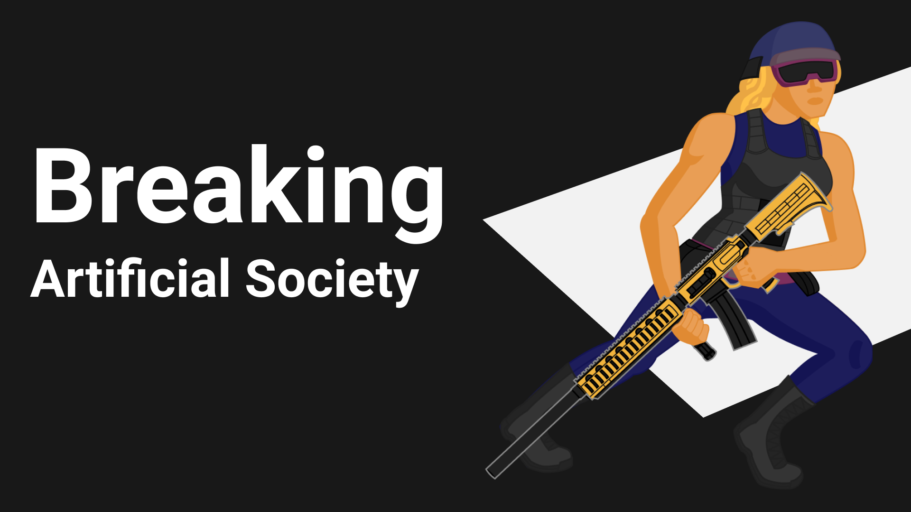

  

<h1 align="center">Breaking Artificial Society</h1>

<blockquote align="center">
 <a href="https://nelsonwenner.itch.io/breaking-artificial-society">Project Game Jam / itch.io</a>
</blockquote>

  

  
   

  

  

## :rocket: Technologies

* [Godot](https://godotengine.org/)

## :electric_plug: Prerequisites
  
- [Godot (>= 3.x)](https://godotengine.org/)

## :memo: License
This project is under the MIT license. See the [LICENSE](LICENSE.md) for more information.

---
